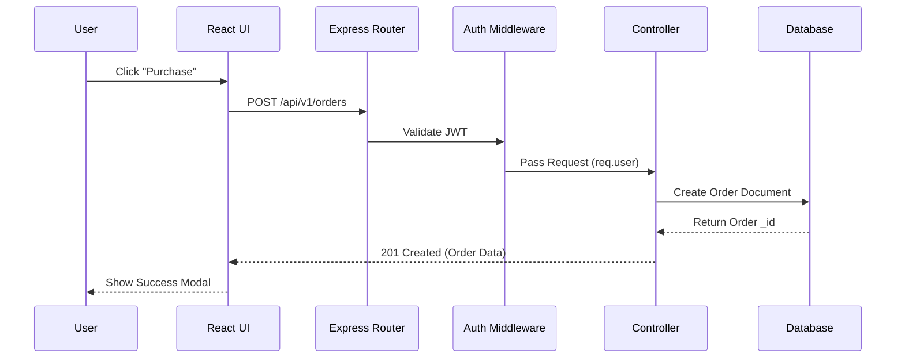
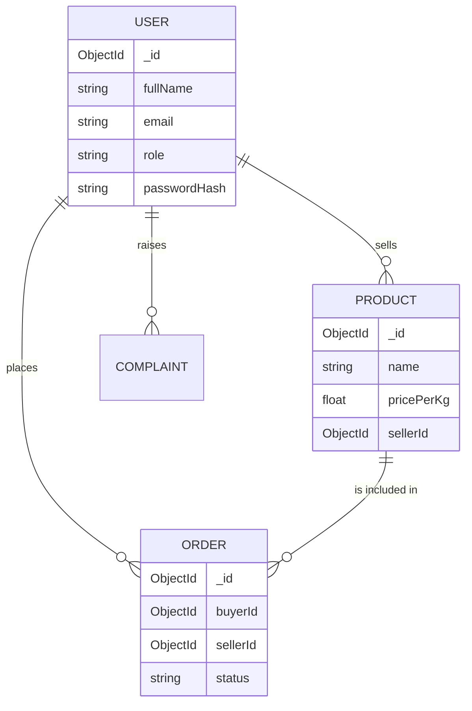

# 1. Complete Repository Audit

## Overall Architecture
PasumaiCholai is a full-stack monolithic web application built using the MERN stack (MongoDB, Express, React, Node.js) with extensive use of AWS services and WebSockets for real-time features.
*   **Design Philosophy**: Service-oriented monolith. The backend is logically separated into domains (auth, marketplace, community, etc.) within a single Express server.
*   **Architectural Style**: Client-Server architecture. RESTful API is the primary communication mechanism, supplemented by WebSockets (Socket.io) for real-time Chat and Community feeds.
*   **Backend Patterns**: Controller-Service-Model pattern. Routes delegate to controllers, which interact with models (and optionally services for complex logic like AWS interactions).
*   **Frontend Patterns**: Single Page Application (SPA) using React. Uses context (AuthContext) and Zustand for global state, React Router for navigation, and highly modularized components split by domain/role.
*   **Layer Responsibilities**:
    *   **Presentation (Client)**: Vite + React, rendering UI based on roles (`FARMER`, `ADMIN`, `CONSUMER`, etc.).
    *   **API/Transport (Server/Routes)**: Express routing and validation middlewares.
    *   **Business Logic (Server/Controllers & Services)**: Handling business rules, Stripe/Razorpay integrations, AWS Polly/SNS integrations.
    *   **Data Access (Server/Models)**: Mongoose schemas defining MongoDB collections.

## Folder-by-folder Analysis

### `/client`
*   **`/src/api`**: API client configurations (e.g., Axios setup, interceptors for JWT tokens).
*   **`/src/assets`**: Static assets like images and fonts.
*   **`/src/components`**: Shared, reusable UI components (Buttons, Inputs, Modals, Cards) used across multiple dashboards.
*   **`/src/context`**: React Context providers (e.g., `AuthContext.tsx` handles authentication state, JWT decoding, and role-based routing).
*   **`/src/dashboards`**: Role-specific dashboard layouts and views (admin, consumer, delivery, expert, farmer, taluk).
*   **`/src/features`**: Domain-specific complex components/pages (ai, chat, community, expertConsultation, marketplace, schemes, grievance).
*   **`/src/i18n` & `/src/locales`**: Internationalization setup and locale dictionaries (React-i18next).
*   **`/src/lib`**: Utility libraries and third-party wrappers (e.g., formatting utilities, UI library initializations).
*   **`/src/routes`**: Application routing logic (`AppRoutes.tsx`, `ProtectedRoute.tsx`), enforcing role-based access control.
*   **`/src/store`**: Zustand stores for global state management.

### `/server`
*   **`/src/chat` & `/src/community`**: Real-time WebSocket gateways (`websocketServer.ts`, `realtime.gateway.ts`) handling live messaging and feed updates.
*   **`/src/config`**: Application configuration variables (`env.config.ts`), database connection logic (`db.ts`).
*   **`/src/controllers`**: Request handlers grouped by resource (e.g., `auth.controller.ts`, `market.controller.ts`, `complaint.controller.ts`).
*   **`/src/jobs`**: Background cron jobs.
*   **`/src/middlewares`**: Express middlewares (error handling, authentication verification, validation).
*   **`/src/models`**: Mongoose schemas defining data structures (User, Product, Order, Complaint, etc.).
*   **`/src/modules`**: Encapsulated sub-domains (e.g., `crop-pricing`, `chatbot`, `marketplace`) containing their own routes/controllers/services.
*   **`/src/routes`**: Express router definitions mapping endpoints to controller functions.
*   **`/src/services`**: Shared business logic services (e.g., interacting with AWS Comprehend/Polly).

## Data Flow
Client Request → Nginx (Reverse Proxy) → Express App (`server.ts` -> `app.ts`) → Middleware (Auth/Validation) → Router (`routes/index.ts`) → Controller → Mongoose Model → MongoDB → JSON Response to Client.

## Authentication Flow
*   **Signup**: User provides details and Aadhaar -> Validated against Aadhaar mock API -> Password hashed (bcrypt) -> Stored in MongoDB.
*   **Login**: Email/Mobile + Password -> Compared against hash -> If valid, a JSON Web Token (JWT) is generated and returned to the client (and optionally set as an HTTP-only cookie).
*   **Authorization**: `ProtectedRoute.tsx` on the frontend checks role. On the backend, `auth.middleware.ts` decodes the JWT and validates the user's role against the endpoint's requirements.

## API Analysis (Key Endpoints)
*   **`POST /api/v1/auth/register`**: Registers a new user. Body: User details.
*   **`POST /api/v1/auth/login`**: Authenticates user. Returns: JWT token.
*   **`GET /api/v1/marketplace`**: Fetches products. Supports pagination/filtering.
*   **`POST /api/v1/marketplace`**: Creates a product listing (Requires `FARMER` role).
*   **`POST /api/v1/orders`**: Initiates an order and payment intent.
*   **`POST /api/v1/complaints`**: Submits a grievance/complaint.

## Database Analysis
*   **`User`**: Core entity (fullName, email, mobile, passwordHash, aadhaarFull, role, address).
*   **`Product`**: Marketplace items (name, cropType, pricePerKg, sellerId ref User).
*   **`Order`**: Transactions (buyerId ref User, sellerId ref User, productId ref Product, status).
*   **`Complaint`/`Grievance`**: Issue tracking.
*   **Relationships**: Standard NoSQL referencing using `ObjectId` (e.g., `Product.sellerId` -> `User._id`).

---

# 2. Security Review

*   **JWT**: Tokens are used, but ensure they have appropriate expiration times (`JWT_EXPIRES_IN`). Token revocation (logout) needs an explicit strategy (e.g., a token blocklist or short expiration + refresh tokens).
*   **Secrets**: Env vars are properly separated (e.g., `.env.production.example`). Never commit raw `.env` files.
*   **Password Hashing**: Utilizes `bcryptjs` which is standard and secure.
*   **NoSQL Injection**: Mongoose abstractions generally protect against standard NoSQL injections, provided inputs are strictly cast to their schema types.
*   **XSS & CSRF**: React natively sanitizes outputs to prevent XSS. For API protection against CSRF, especially if using cookies for JWT, implement CSRF tokens or rely on strict CORS + Authorization headers.
*   **Rate Limiting**: Currently lacking explicit rate limiters (e.g., `express-rate-limit`). Crucial for `/auth/login` and `/auth/register` to prevent brute-force attacks.
*   **CORS**: Configured in `app.ts` (`cors({ origin: env.CLIENT_ORIGIN })`). Safe as long as `CLIENT_ORIGIN` is strictly defined in production (not `*`).
*   **File Uploads**: `multer` is used for `/uploads`. Must enforce strict file size limits and MIME-type validation to prevent malicious payload executions or server storage exhaustion.

**Improvements**:
1. Implement `express-rate-limit` on all public routes.
2. Implement `helmet` for secure HTTP headers.
3. Validate and sanitize all inputs strictly using Zod validation middlewares before they reach the controller.

---

# 3. Performance Review

*   **Expensive Queries**: Any `find()` on `Product` or `Order` without pagination limits will slow down as data grows. Ensure `.limit()` and `.skip()` are universally applied.
*   **Caching**: No Redis or in-memory caching is currently implemented. Frequent reads (e.g., Crop Prices, Active Schemes) should be cached.
*   **Indexing**: MongoDB indexes are defined (e.g., `userSchema.index({ email: 1 })`), which is good. Ensure complex query paths (e.g., querying products by `cropType` AND `location`) have compound indexes.
*   **Frontend Bundle Size**: Importing the entire `aws-sdk` or `framer-motion` can bloat bundles. Ensure Vite is successfully tree-shaking dependencies.
*   **Unnecessary Renders**: Use React `useMemo` and `useCallback` in heavily re-rendered components, particularly those subscribing to WebSocket updates (Community Feed, Chat).

---

# 4. Scalability Review

*   **Current Limitations**: Monolithic Node.js process is single-threaded. Stateful WebSockets will fail to broadcast across multiple instances without a Pub/Sub adapter.
*   **Scaling Bottlenecks**:
    1. MongoDB vertical scaling limits.
    2. WebSocket connections binding to a single server instance.
*   **Horizontal Scaling**: To scale the backend horizontally (multiple EC2s/containers), `Socket.io` must be configured with a Redis Adapter so messages broadcast across all nodes.
*   **Caching**: Implement Redis for caching API responses (e.g., marketplace listings, crop prices) to reduce DB load.
*   **Future Microservices**: The `/chat`, `/community`, and `/marketplace` modules are tightly coupled but conceptually distinct. They are prime candidates to be split into separate microservices if load dictates.

---

# 5. Architecture Review

*   The monolithic architecture is highly appropriate for the current startup phase.
*   Separating domain logic into `/modules` (e.g., `crop-pricing`) is excellent for maintainability and sets a good precedent for eventual microservices extraction.
*   The use of WebSockets alongside REST allows for a modern, responsive UX without polling.
*   Integration with AWS Services (Polly/Transcribe) directly from the backend controllers should ideally be abstracted into dedicated Queue Workers to prevent long-running requests from blocking the Express event loop.

---

# 6. DevOps Review

*   **Docker**: Good use of `Dockerfile` and `docker-compose.production.yml`. It mounts volumes for `/uploads` ensuring persistence across container restarts.
*   **Nginx**: Used as a reverse proxy, handling SSL termination (Certbot) and routing port 80/443 to the internal Docker port (5000/5001). This is standard and robust.
*   **CI/CD**: `deployment.md` mentions GitHub Actions. CI/CD pipelines should ensure testing and linting pass before executing an SSH deploy.
*   **Improvements**:
    1. Implement a staging environment.
    2. Move from manual SSH git pull deployments (as suggested in `deployment.md` rollback) to a fully automated pipeline pushing Docker images to a registry (e.g., ECR/DockerHub) and updating the service.

---

# 7. Missing Features

*   **Logging Observability**: While `winston` is used, logs are stored in `json-file` via Docker. No central log aggregation (like ELK stack or Datadog) is present.
*   **Monitoring**: No APM (Application Performance Monitoring) tools like New Relic or Sentry are configured to catch unhandled frontend/backend exceptions in production.
*   **Testing**: E2E testing framework (Cypress/Playwright) and unit tests (Jest/Vitest) are missing or sparse. A `test:sns:e2e` script exists, but comprehensive coverage is lacking.
*   **Input Validation**: Needs a holistic, unified validation schema layer (e.g., Zod) on the server to prevent malformed data.
*   **Soft Deletes**: Implementing soft deletes (a `deletedAt` timestamp) instead of hard deletes prevents accidental permanent data loss.

---

# 8. Technical Debt Report

*   **Loose Typing**: Search for `any` or loose typings in the TypeScript codebase. Using strict typing across the board prevents runtime errors.
*   **Controller Bloat**: Some controllers (e.g., `complaint.controller.ts`, `consumer-marketplace.controller.ts`) are very large. Business logic should be extracted to `*.service.ts` files.
*   **Hardcoded Values**: Ensure all magic numbers and environment-specific strings are moved to `env.config.ts`.
*   **Unused Dependencies**: Periodically audit `package.json` for unused packages using tools like `depcheck`.

---

# 9. Mermaid Diagrams

### Architecture Diagram
```mermaid
graph TD
    Client[Client (React/Vite)] -->|HTTP/HTTPS| Nginx[Nginx Reverse Proxy]
    Client -->|WebSocket| Nginx
    Nginx -->|Port 5000| Server[Node.js Express Server]
    
    Server -->|Mongoose| MongoDB[(MongoDB Database)]
    Server -->|AWS SDK| AWS[AWS Services (S3, Polly, SNS)]
    Server -->|Stripe/Razorpay SDK| PaymentGW[Payment Gateways]
    Server -->|OpenAI SDK| AI[OpenAI API]
```

### Request Lifecycle Flow


### Database ER Diagram (Simplified)

